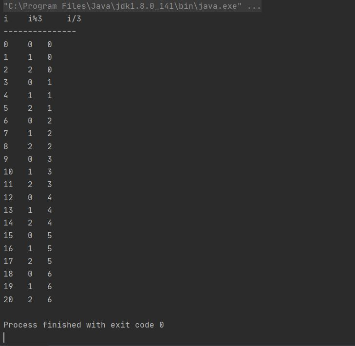

# JAVA ONLINE STUDY _ STUDYHALLE #4
__목표 : 자바가 제공하는 제어문 학습하기.__

---


## 제어문 control statement 이란?

- 코드의 실행흐름을 바꾸는 역할을 하는 문장  
- 위에서 아래로 순차적으로 진행되는 흐름 이외에, 조건에 따라 문장을 건너뛰고 때로는 같은 문장을 반복해서 수행할 수 있도록 한다.  
- 제어문에는 조건에 따라 다른 문장이 수행되도록 하는 조건문과, 특정문장들을 반복해서 수행하는 반복문이 있다.  

## 조건문 if, switch  

- 조건문은 조건식과 문장을 포함하는 블럭 {} 으로 구성되어 있으며, 조건식의 연산결과에 따라 실행할 문장이 달라진다.
- 조건문에는 if문, switch문이 있는데 if문이 주로 사용된다.
- 경우의 수가 많을 때는 switch문이 효율적이지만, if문보다 제약이 많다.

### ▶ if  

- 가장 기본적인 조건문으로, 조건식과 괄호로 이루어져 있다.
```
  if(조건식) {  
    // 조건식이 true일 때, 괄호 {} 안의 문장들이 수행된다.  
  }  
```

- 조건식은 일반적으로 비교연산자와 논리연산자로 구성된다.  
- 조건식의 결과는 반드시 true, false 중 하나일 필요가 있다.  
- 블럭 block {} 내에는 보통 여러 문장을 넣지만, 한 문장만 넣거나 아무런 문장도 넣지 않을 수 있다.  
  블럭 내의 문장이 한 문장일 경우, 괄호를 생략할 수 있다.  
```
  if (score > 60)  
    System.out.println("합격입니다.");  
```  

#### if-else  
- 조건식이 어느 한 쪽이 참이면 다른 한 쪽이 거짓인 상반된 관계에 있을 경우, if-else 문으로 작성할 수 있다.  
  이러한 경우 두 개의 if문으로 작성할 수도 있지만, if-else문이 하나의 조건식만 계산하면 되므로 더 효율적이고 간단하다.  
```
  if (조건식) {  
    // 조건식이 true 일 때 수행된다.  
  } else {  
    // 조건식이 false 일 때 수행된다.  
  }  
```  

#### if-else if  
- 처리해야 할 경우의 수가 셋 이상인 경우에 사용할 수 있다.  
```
  if (조건식 1) {  
    // 조건식 1이 true 일 때 수행된다.  
  } else if (조건식 2) {  
    // 조건식 2가 true 일 때 수행된다.  
  } else if (조건식 3) {  
    // 조건식 3이 true 일 때 수행된다.  
  } else { 
    // 마지막은 보통 else 블럭으로 끝나며, 생략가능하다.  
    // 위의 어느 조건식도 만족하지 않을 때 수행된다.  
  }
```

- 조건식 1 부터 순서대로 평가하여 결과가 참인 조건식을 만나면 해당 블럭만 수행 후 if문 전체를 벗어난다.
- 결과가 참인 조건식이 하나도 없을 경우 else블럭이 수행되는데, else블럭이 생략된 경우 어떠한 블럭도 수행되지 않는다.  


#### 중첩 if  
- if문 블럭 내에 또 다른 if문을 포함시키는 형태로, 횟수에는 거의 제한이 없다.
```
  if (조건식) {  
    // 조건식 1이 true 일 때 수행된다.  
    
    if (조건식 2) {  
      // 조건식 1, 2가 모두 true일 때 수행된다.  
    } else {  
      // 조건식 1은 true, 2는 false 일 때 수행된다.  
    }  
    
  } else {  
    // 조건식 1이 false 일 때 수행된다.  
  }  
``` 


#### 예제  

```java
package com.studyhalle;

import java.util.Scanner;

public class Main {

    public static void main(String[] args) {
        int score = 0;
        char grade = ' ', opt = '0';

        System.out.print("점수를 입력하세요. > ");

        Scanner sc = new Scanner(System.in);
        score = sc.nextInt();

        System.out.printf("점수는 %d 입니다.%n", score);

        if (score >= 90) {
            grade = 'A'; // score가 90점이상이면 A
            if(score >= 98) {
                opt = '+'; // score가 90점이상, 98점이상 A+
            } else if (score < 94) {
                opt = '-'; // score가 90점이상, 94점미만 A-
            }

        } else if (score >= 80) {
            grade = 'B'; // score가 80점이상이면 B
            if(score >= 88) {
                opt = '+';
            } else if (score < 84) {
                opt = '-';
            }

        } else {
            grade = 'C'; // 나머지는 C
        }

        System.out.printf("당신의 학점은 %c%c입니다.%n", grade, opt);
    }
}

```
#### 실행결과  

  
<br>


### ▶ switch  
- 단 하나의 조건식으로 많은 경우의 수를 처리할 수 있고, 표현도 간결하다.  
  if문은 조건식의 결과가 참과 거짓 두 가지 밖에 없기 때문에, 경우의 수가 많아질 수록 복잡해지고 처리시간도 길어진다.  
  따라서 처리할 경우의 수가 많은 경우에는 if문 보다 switch문이 효율적이다.  
  다만, switch문은 제약조건이 있기 때문에 사용할 수 없는 경우도 있다.  
  
```
  switch (조건식) {  
    case 값1 : // 조건식의 결과가 값 1과 같을 경우
        // 이하의 문장들을 수행
        // ...
        break;
    case 값2 : // 조건식의 결과가 값 2와 같을 경우
        // ...
        break;
    case 값3 : 
          .
          .
          .
    default : // 조건식의 결과와 일치하는 case문이 없을 경우  
      // ...  
  }  
```
<br>


- break : switch문을 빠져나올 수 있으며, 각 case문의 영역을 구분하는 역할을 한다.  
  각 case문의 끝에 break문이 없으면 switch문이 끝날 때 까지의 모든 문장들을 수행하므로 생략하지 않는 것이 원칙이다.  
  다만 경우에 따라서 고의적으로 break문을 생략하는 경우도 있다.  

#### 예제  
``` java
package com.studyhalle;

import java.util.Scanner;

public class SwitchEx {

    public static void main(String[] args) {
        int level = 0;

        System.out.print("레벨을 입력하세요. (1,2,3) > ");

        Scanner sc = new Scanner(System.in);
        level = sc.nextInt();

        switch (level) {
            case 3 :
                System.out.println("삭제권한이 부여되었습니다.");
            case 2 :
                System.out.println("쓰기권한이 부여되었습니다.");
            case 1 :
                System.out.println("읽기권한이 부여되었습니다.");
        }
    }

}
```
#### 실행결과  

  

- 레벨에 따라 해당하는 권한을 부여받게 된다. 3일 경우 삭제, 쓰기, 읽기 권한이 모두 부여되고, 1일 경우는 읽기 권한만 갖게 된다.  
<br>

  
- default : 조건식의 결과와 일치하는 case문이 없을 경우 수행되는 문장이다.  
  if문의 else문과 같은 역할로, 위치는 상관없으나 보통 마지막에 놓기 때문에 break문이 필요하지 않다.  


#### switch문의 제약조건  
- switch문의 조건식의 결과는 정수 또는 문자열이어야 한다.
- case문의 값은 정수 상수만 가능하며, 중복되지 않아야 한다.
  변수, 실수, 문자열은 case문의 값으로 사용할 수 없다.
<br>


## 반복문 for, while, do-while  

- 반복문은 어떠한 작업이 반복적으로 수행되도록 할 때 사용된다.  
- 주어진 조건을 만족하는 동안, 주어진 문장을 반복적으로 수행하므로 조건식을 포함한다.
- for, while : 조건에 따라 한 번도 수행되지 않는 경우도 있다.  
  do-while : 최소 한 번은 수행된다.  


### ▶ for  

- 반복횟수를 알고 있을 때 적합한 반복문이다. 구조는 복잡하지만 직관적으로 표현되어 이해하기 쉽다.  
```
  for ( 초기화 ; 조건식 ; 증감식 ) {  
    // 주어진 조건이 만족되는 동안 반복수행 될 문장  
  }  
```  
- 초기화 → 조건식판별 → 참 : 블럭 내 문장 → 증감식 순으로 수행되며, 조건식이 거짓일 경우 for문을 빠져나간다.  


- 초기화 : 반복문에 사용될 변수를 초기화 하는 부분으로 최초에 한 번만 수행된다.  
  일반적으로 변수 하나로 제어하지만, 둘 이상의 변수가 필요할 때는 구분자 , 로 변수를 초기화 한다.  
  이 때, 두 변수의 타입은 같아야 한다.  
- 조건식 : 조건식이 참인 동안 반복을 계속하고, 거짓이면 반복을 중단한다.  
  조건식에 따라 문장이 한 번도 수행되지 못하거나, 무한루프에 빠지기도 하므로 주의해야 한다.
- 증감식 : 반복문을 제어하는 변수의 값을 증가, 감소시키는 식이다.  
  반복마다 변수의 값이 증감식에 의해 점진적으로 변화하다, 조건식이 거짓이 되는 시점에 for문을 벗어나게 된다.  
  일반적으로 ++가 주로 사용되지만, 다양한 연산자들로 작성가능하다.  
```  
  for (int i=0; i<10; i++) { ... }  
  for (int i=0, j=10; i<10; i++, j--) { ... }  // for문의 제어에 사용될 변수가 여러 개 인 경우
  for (int i=0; i<10; i+=2) // 1부터 10까지 2씩 증가  
```  
- 초기화, 조건식, 증감식은 모두 생략가능하며, 이 경우 조건식은 참으로 간주되어 무한반복문이 된다.  
  이러한 경우 보통 블럭 안에 조건문을 넣어 특정조건을 만족할 시 for문을 빠져나오도록 작성한다.  
- 여러 개의 변수를 사용가능하지만, 변수의 수가 적은 것이 더 효율이고 간단하므로 불필요한 변수의 사용은 줄이도록 작성한다.  


#### 예제  
```java
package com.studyhalle;

public class ForEx {
    public static void main(String[] args) {

        System.out.println("i \t i%3 \t i/3");
        System.out.println("---------------");

        for (int i = 0; i <= 20; i++) {
            System.out.printf("%d \t %d \t %d%n", i, i%3, i/3);
        }
    }
}
```  
#### 실행결과  

  

- 나머지연산자 % 는 나누는 수보다 작은 수의 범위를 순환하면서 반복하고,  
  나누기연산자 / 는 나누는 수 만큼 같은 값이 연속적으로 반복되게 할 수 있다. (int) 
  

#### 중첩 for  

#### 예제  
```java
package com.studyhalle;

public class forEx {
    public static void main(String[] args) {

        for (int i = 1; i < 6; i++) {
            for (int j = 1; j < 6; j++) {
                if(i==j) {
                    System.out.printf("[%d, %d]", i, j);
                } else {
                    System.out.printf("%5c", ' ');
                }
            }
                System.out.println();
        }
    }
}
```
#### 실행결과  
  
<br>


#### 향상 for (enhanced for statement)  

- JDK 1.5부터 적용된 for문의 새로운 문법  
```
  for (타입 변수명 : 배열, 컬렉션) {
    // 반복할 문장
  }
```  
- 위의 문장에서 변수명 앞의 타입은 배열이나 컬렉션 요소의 타입이어야 한다.  
  배열/컬렉션에 저장된 값이 반복마다 하나씩 순서대로 읽혀 변수에 저장되고, 이 변수를 사용해 반복문 블럭 내의 코드를 작성한다.  

#### 예제  
```java
package com.studyhalle;

public class ForEachEx {
    public static void main(String[] args) {
        int[] arr = {10, 20, 30, 40, 50};
        for (int tmp : arr) {
            System.out.println(tmp);
        }
    }
}
```  

#### 실행결과
  
<br>


### ▶ while  

- 조건식, 블럭만으로 이루어져 있으며 조건식이 true인 동안, 즉 조건식이 false가 될 때까지 블럭내의 문장을 반복한다.  

```
  while (조건식) {
    // 조건식의 연산결과가 true 인 동안, 반복될 문장
  }
```  

- 먼저 조건식을 평가한 후 조건식이 false일 경우 문장 전체를 벗어나고, true일 경우 블럭내의 문장을 수행한 후 다시 조건식을 평가한다.  
- 일반적으로 for문과 while문은 서로 변환이 가능하지만, 초기화나 증감식이 필요하지 않은 경우라면 while문이 더 적합하다.  
- for문과 달리 while문의 조건식은 생략이 불가능하다. for문의 조건식 생략과 같은 효과를 얻고싶다면 조건식에 true를 넣으면 된다.  

#### 예제  

```java
package com.studyhalle;

import java.util.Scanner;

public class WhileEx {
    public static void main(String[] args) {
        int num = 0, sum = 0;
        System.out.print("각 자리의 합을 구합니다. 숫자를 입력하세요 >> ");

        Scanner sc = new Scanner(System.in);
        String tmp = sc.nextLine() ;
        num = Integer.parseInt(tmp);

        while(num != 0) {
            sum += num%10;
            System.out.printf("sum=%3d, num= %d%n", sum, num);
            num = num/10;
        }
        
        System.out.println("결과 : "+sum);
}
```  

#### 실행결과
  
<br>


### do-while  
- while 문의 변형으로, while문의 조건문과 블럭의 순서를 바꿔놓은 것이다.  
- while문과 반대로 블럭 내의 문장을 먼저 수행한 후 조건식을 평가한다.  
- while문이 조건식의 결과에 따라 블럭 내 문장이 한 번도 수행되지 않을 수 있으나,
  do-while문은 최소 한 번은 수행된다.
```
  do {
    // 조건식의 연산결과가 true일 경우 수행될 문장
  } while (조건식);
```


### ▶ break, continue  

- break : 조건문, 반복문에서 사용할 수 있는데, 자신이 포함된 가장 가까운 반복문을 벗어난다.  
  주로 if문과 함께 특정 조건을 만족하면 반복문을 벗어나도록 사용된다.  
- continue : 반복문 내에서만 사용되며, 반복이 진행되는 중 continue를 만나면 반복문의 끝으로 이동하여 다음 반복으로 넘어간다.
  for문의 경우 증감식으로, while문의 경우 조건식으로 이동한다.
  반복문 전체를 벗어나지 않으며, continue문 이후의 문장들을 수행하지 않고 다음 반복을 계속해서 수행할 수 있다.


### ▶ 이름 붙은 반복문  

- break문은 근접한 단 하나의 반복문만 벗어날 수 있기 때문에,  
  여러 개의 반복문이 중첩된 경우에는 break문으로 완전히 벗어날 수 없다.  
  이 때 중첩반복문 앞에 이름을 붙이고 break, continue문에 이름을 지정해줌으로써  
  하나 이상의 반복문을 벗어나거나 반복을 건너뛸 수 있다.  


#### 예제  

```java
package com.studyhalle;

public class NamedLoopEx {
    public static void main(String[] args) {
        Loop1 :for (int i = 2; i < 6; i++) {
            for (int j = 1; j < 9; j++) {
                if (j==5)
                    break;
                System.out.println(i+" * "+j+" = "+ i*j);
            }
            System.out.println();
        }
    }
}
```

#### 실행결과  
  
<br>


#### 예제  

```java
package com.studyhalle;

public class NamedLoopEx {
    public static void main(String[] args) {
        Loop1 :for (int i = 2; i < 6; i++) {
            for (int j = 1; j < 9; j++) {
                if (j==5)
                    break Loop1;
                System.out.println(i+" * "+j+" = "+ i*j);
            }
            System.out.println();
        }
    }
}
```

#### 실행결과  
  
<br>


---  

