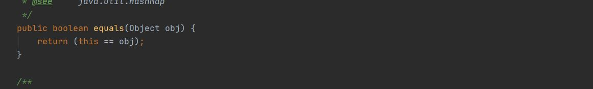
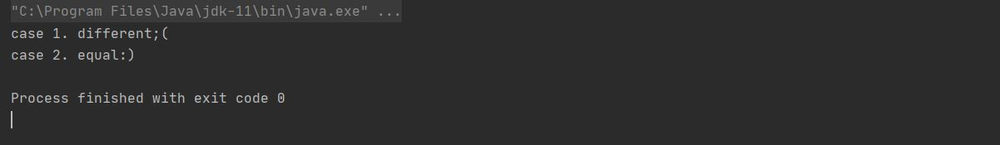
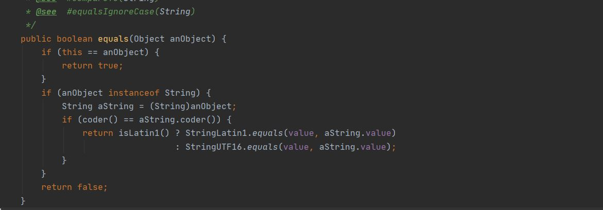
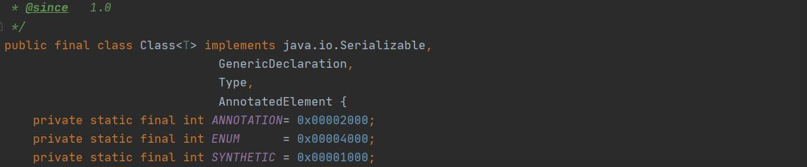
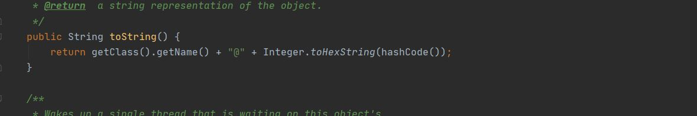
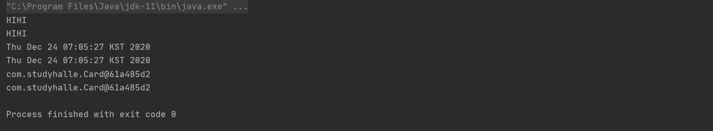

# JAVA ONLINE STUDY _ STUDYHALLE #6  
__과제 : 상속__  
__목표 : 자바의 상속에 대해 학습하기.__

---

## 자바 상속의 특징  


`상속 inheritance` 이란, 기존의 클래스를 재사용하여 새로운 클래스를 작성하는 것이다. 상속을 통해 클래스를 작성하면 보다 적은 양의 코드로 새로운 클래스를 작성할 수 있고, 코드를 공통적으로 관리할 수 있기 때문에 코드의 추가 및 변경이 용이하다. 이러한 특징은 코드의 재사용성을 높이고 코드의 중복을 제거하여 프로그램의 생산성 및 유지보수에 크게 기여한다.  

```
  class Parent { ... }
  class Child extends Parent { ... }
```

키워드 `extends` 를 사용하여 상속관계를 구현할 수 있다.  
`Parent` 클래스와 `Child` 클래스는 서로 상속관계에 있으며, 상속 해 주는 `Parent`클래스를 __조상클래스__ (parent, super, base ..) , 상속 받는 `Child` 클래스를 __자손클래스__ (child, sub, derived ..) 라고 한다.

자손클래스는 조상클래스의 모든 멤버 -생성자, 초기화블럭은 상속되지 않는다.- 를 상속받으므로 언제나 조상클래스와 같거나 많은 수의 멤버를 갖는다. 때문에, 상속을 받는다는 것은 조상클래스를 확장(extend)한다는 의미이기도 하다.  

```java
  class Parent { int age; }
  
  class FirstChild extends Parent { ... }
  
  class SecondChild extends Parent { 
    void hello() { System.out.print("HELLO!"); }
  }
  
  class GrandChild extends FirstChild { 
    void bye() { System.out.print("BYE~"); }
  }
```

`FirstChild`클래스와 `SecondChild`클래스는 모두 `Parent`클래스와 상속관계에 있으나 `FirstChild`-`SecondChild` 두 클래스 사이에는 아무런 관계도 성립되지 않는다.  

자손클래스는 조상클래스의 모든 멤버를 물려받으므로, `GrandChild`클래스는 `Child`클래스의 멤버와 `Child`클래스가 `Parent`클래스로부터 상속받은 멤버까지 모두 상속받는다. `GrandChild`클래스와 `Parent`클래스는 간접적인 상속관계에 있다.  

상속관계를 이용해 코드의 중복을 줄일 수 있다. 공통적인 부분을 조상클래스 한 곳에서 관리함으로써 코드의 중복이 줄어들어 유지보수가 보다 수월하며, 일관성을 유지하기 쉬워진다. 
프로그램을 구성하는 전체 클래스들을 설계, 분석하여 클래스간의 적절한 상속관계를 만드는 것은 객체지향 프로그래밍에서 아주 중요한 부분이다.  


### 포함 composite 관계  

클래스 간의 `포함관계`를 맺어주는 것은 한 클래스의 멤버변수로 다른 클래스 타입의 참조변수를 선언하는 것을 의미한다.  

```java
  class Point {
    int x;  // x좌표
    int y;  // y좌표
  }
  
  class Circle {
    Point c = new Point();  
    int r;                  // 반지름
  }
```

하나의 거대한 클래스를 작성하는 것 보다, 단위별로 여러개의 클래스를 작성하고 이 클래스들을 포함관계로 재사용하면 보다 간결하고 손쉽게 클래스를 작성할 수 있으며, 코드관리도 수월하다.  
- 상속관계 : ~은 ~이다. (is)
- 포함관계 : ~은 ~을 가지고 있다. (has)

이 설명은 반드시 일치하는 것은 아니지만, 클래스간의 관계를 만드는 데 있어 기본적인 틀을 잡을 수 있도록 도와준다.  


### 단일 상속 single inheritance  

C++과 같이 여러 조상클래스로부터 상속을 받을 수 있는 `다중상속 multiple inheritance` 이 허용되는 객체지향언어가 있는 반면, 자바는 `단일상속` 만을 허용한다.  
다중상속은 복합적인 기능을 가진 클래스를 쉽게 작성할 수 있지만, 서로 다른 클래스로부터 상속받은 멤버간의 이름이 같은 경우 구별이 불가능하다는 단점이 있다. 이를 해결하기 위해서는 조상클래스 멤버의 이름을 바꾸어야 하는데, 이 조상클래스를 상속받는 또다른 자손클래스가 존재하는 경우 여러 복잡한 상황이 발생할 수 있다.  
단일상속 또한 클래스간의 관계가 명확해 신뢰성 있는 코드를 작성할 수 있지만, 하나의 조상클래스만을 가질 수 있기 때문에 불편한 점도 있다. 이러한 경우에는, 상속과 포함관계를 적절히 이용하여 단점을 극복할 수 있다.  
<br>


## super 키워드  

`super`은 자손클래스에서 조상클래스로부터 상속받은 멤버를 참조하는데 사용되는 참조변수이다. 멤버변수와 지역변수의 이름 이 같을 때 `this`를 붙여 구별한 것과 마찬가지로, 상속받은 멤버와 자신의 클래스에 정의된 멤버의 이름이 같을 경우 `super`을 붙여서 구별한다.  
조상의 멤버와 자신의 멤버를 구별하는데 사용된다는 점을 제외하면 `super`와 `this`는 근본적으로 같다고 할 수 있다. 모든 인스턴스 메서드에는 자신이 속한 인스턴스의 주소가 지역변수로 저장되는데, 이것이 `super`와 `this`의 값이 된다. 또한, `this`와 마찬가지로 `super` 역시 static메서드에서는 사용할 수 없다.  


### super()  

조상클래스의 생성자를 호출하는데 사용된다.  
자손클래스의 인스턴스 생성 시, 자손의 멤버와 조상의 멤버를 모두 사용할 수 있다. 때문에 조상클래스의 멤버들이 먼저 초기화 될 수 있도록 자손클래스 생성자의 첫 줄에 `super()` 를 호출한다. 이러한 조상클래스 생성자의 호출은 클래스의 상속관계를 거슬러 올라가면서 계속 반복되어 마지막으로 모든 클래스의 최고 조상클래스인 `Object`클래스까지 가서 끝이 난다. 때문에 `Object`클래스를 제외한 모든 클래스의 새성자는 첫 줄에 반드시 `this()` 나 `super()`를 호출한다. 그렇지 않을 경우 컴파일러에 의해 자동적으로 `super();`가 삽입된다.   


## 메서드 오버라이딩 method overriding  

조상클래스로부터 상속받은 메서드의 내용을 자손클래스에서 적절하게 사용하기 위해 메서드의 내용을 변경하는 것을 `오버라이딩 overriding`이라 한다. 
오버라이딩은 메서드의 내용만을 새로 작성하는 것으로, 선언부 -이름, 매개변수, 반환타입- 는 조상의 것과 완전히 일치해야 한다. 
다만 접근제어자와 예외는 제한된 조건 하에서 변경할 수 있다.
- 접근제어자 : 조상클래스의 메서드와 같거나 넓은 범위로 변경할 수 있다.  
- 예외 : 조상클래스의 메서드보다 많은 수의 예외를 선언할 수 없다. (개수가 아닌 범위의 문제!)  


또한 인스턴스메서드 → static메서드, static메서드 → 인스턴스메서드로의 변경도 불가능하다. static이 붙은 멤버는 자신이 정의된 클래스에 종속되어있다.   


### 메서드 오버로딩 method overloading  

한 클래스 내에 같은 이름의 메서드를 여러 개 정의하는 것을 `오버로딩 overloading`이라 한다. 하나의 메서드 이름으로 여러 기능을 구현할 수 있기 때문에 overload라는 이름이 붙여졌다. 같은 기능을 가졌지만 매개변수를 달리해야하는 경우에 메서드 오버로딩을 사용할 수 있다. 
중복 정의가 아닌 오버로딩을 만족시키기 위해서는, 메서드 이름이 같으며 매개변수의 개수나 타입이 달라야 한다. 반환타입은 오버로딩의 구현에 아무런 영향을 끼치지 않는다.  

메서드 오버로딩의 대표적인 예로 `println()` 메서드를 들 수 있다.  

```
  void println()
  void println(boolean x)
  void println(char x)
  void println(char[] x)
  void println(double x)
  void println(float x)
  void println(int x)
  void println(long x)
  void println(Object x)
  void println(String x)
```

println() 메서드 호출 시, 매개변수로 넘겨주는 값의 타입을 판별하여 위의 오버로딩 된 메서드들 중 하나가 실행된다.  


## 다이나믹 메소드 디스패치 (Dynamic Method Dispatch)  

오버라이드 된 메서드가 참조에 의해 호출될 때 참조하는 객체 유형에 따라 실행할 메서드 버전을 판별하는데, 이러한 판별이 컴파일타임이 아닌 런타임에 이루어지는 것.


https://defacto-standard.tistory.com/413


## 추상 클래스 (abstract class)  

`추상클래스 abstract class`란, 추상메서드를 포함하고 있는 클래스이다. 추상클래스 자체로는 완전한 클래스로서의 역할을 할 수 없으며 추상클래스로 인스턴스를 생성하는 것 또한 불가능하다. 그러나 새로운 클래스를 작성하는 데 있어 바탕이 되는 조상클래스로서 중요한 의미를 가지며 상속을 통해 자손클래스에 의해서 완성될 수 있다. 키워드 `abstract`로 추상클래스를 구현한다.  

```
  abstract class 클래스명 { ... }
```

여러 클래스에 공통적으로 사용될 수 있는 클래스를 바로 작성하기도 하고, 기존 클래스의 공통적인 부분을 뽑아 추상클래스로 작성한 뒤 상속하는 경우도 있다. 상속계층도를 따라 내려갈수록 클래스는 점점 기능이 추가되어 구체화의 정도가 심해지며-세분화되며, 상속계층도를 따라 올라갈수록 추상화의 정도가 심해진다-공통요소만 남게된다.  


### 추상메서드 (abstract method)  

`추상메서드 abstract method` 란, 메서드의 선언부만 작성하고 구현부는 작성하지 않은 채로 남겨둔 것을 말한다. 메서드의 내용은 상속받는 클래스에 따라 달라질 수 있기 때문에, 조상클래스에서 선언부만을 작성하고, 구현부는 상속받는 클래스에서 구현할 수 있도록 비워두는 것이다. 추상메서드 역시 `abstract`로 구현할 수 있다. 추상메서드를 포함하고 있다는 점을 제외하고는 일반클래스와 크게 다르지 않다. 생성자, 멤버변수, 메서드 모두 존재가능하다.  

```
  /* 주석을 통해 해당 메서드의 기능, 목적을 설명하는 것이 좋다. */
  abstract 리턴타입 메서드명();
```

추상클래스를 상속받는 자손클래스는, 조상클래스(추상클래스)의 추상메서드를 모두 구현해야 한다. 하나라도 구현하지 않을 시, 자손클래스 역시 추상클래스로 지정해야 한다.  
메서드를 사용하는 입장에서, 메서드 내부의 내용을 모르더라도 선언부만 알고 있으면 호출이 가능하므로 메서드의 선언부를 알맞게 작성하는 것은 아주 중요하다. 때문에 이러한 추상메서드 및 클래스가 의미있게 사용될 수 있다.  

```
  ① abstract void add(int x, int y);
  ② void add (int x, int y) { }
```

메서드의 내용을 비워놓는 것은, 2와 같이 굳이 `abstract`를 사용하지 않고 일반 메서드로 정의하는 방법으로도 가능하다. 그러나 굳이 추상메서드로 선언하는 이유는 자손클래스에서 반드시 해당 메서드를 구현하도록 강제성을 부여하기 위해서이다. 2의 경우는 실제 구현부는 존재하지 않지만 {} 이 존재하는 것만으로도 일반메서드로 간주되기 때문에 자손클래스에서 오버라이딩 하지 않아도 사용할 수 있기 때문이다.  


## final 키워드  

### 제어자 modifier

클래스, 변수, 메서드의 선언부에 함께 사용되어 부가적인 의미를 부여하는 키워드.  
접근제어자와 그 외의 제어자로 나눌 수 있으며 하나의 대상에 대해 여러 제어자를 조합하여 사용하는 것도 가능하다.  
다만 접근제어자는 한 번에 하나만 사용할 수 있다.  

```
  접근제어자 - public, protected, default, private
  그 외 - static, final, abstract, native, transient, synchronized, volatile, strictfp
```

### static - 클래스의, 공통적인  

`static`이 붙은 멤버변수와 메서드, 초기화 블럭은 인스턴스가 아닌 클래스에 관계된 것으로 인스턴스를 생성하지 않고 사용할 수 있다.  
인스턴스 메서드와 static 메서드의 근본적인 차이는 메서드 내에서 인스턴스 멤버를 사용하는가의 여부에 있다.  
인스턴스 멤버를 사용하지 않는 메서드는 static 메서드로 선언하면 인스턴스를 생성하지 않고도 호출가능하기 때문에 더 편리하다.  

| 대상 | 의미 |
|:-----:|-------|
| 멤버변수 | 모든 인스턴스에 공통적으로 사용되는 클래스 변수로, 인스턴스를 생성하지 않고 사용가능하다. <br> 클래스가 메모리에 로드될 때 생성된다. |
| 메서드   | 인스턴스를 생성하지 않고도 호출이 가능한 static 메서드가 되며,<br>이 메서드 내에서는 인스턴스멤버들을 직접 사용할 수 없다. |


### final - 마지막의, 변경될 수 없는  

| 대상 | 의미 |
|:-----:|-------|
| 클래스 | 변경될 수 없는-확장될 수 없는 클래스. 다른 클래스의 조상이 될 수 없다. |
| 메서드 | 변경될 수 없는 메서드. 오버라이딩을 통해 재정의 할 수 없다. |
| 멤버변수, 지역변수 | 값을 변경할 수 없는 상수 |

`final`이 붙은 변수는 상수가 되므로 일반적으로 선언과 동시에 초기화가 이루어지지만, 인스턴스변수의 경우 생성자에서 초기화되도록 할 수 있다. 매개변수를 갖는 생성자를 선언하여, 인스턴스를 생성할 때 final이 붙은 멤버변수를 초기화하는 데 필요한 값을 생성자의 매개변수로부터 제공받는 것이다. 이러한 방법으로 각 인스턴스마다 final이 붙은 멤버변수가 다른 값을 갖게 하는 것이 가능하다.  

```java
class Card {

  final int NUMBER;
  final String KIND;
  
  Card (String kind, int num) {
    KIND = kind;
    NUMBER = num;   // 매개변수로 넘겨받은 값으로 상수를 초기화한다.
  }
}
```

### abstract - 추상의, 미완성의  

`abstract` 는 추상메서드 및 추상클래스의 선언에 사용되는 키워드이다.  

| 대상 | 의미 |
|:-----:|-------|
| 클래스 | 클래스 내에 추상메서드가 선언되어 있음을 의미한다. |
| 메서드 | 선언부만 작성하고 구현부는 작성하지 않은 추상 메서드임을 알린다. |


### 접근제어자 access modifier  

접근제어자는 멤버, 클래스에 사용되어 해당하는 멤버 또는 클래스를 외부에서 접근하지 못하도록 제한하는 역할을 한다.  
클래스, 멤버변수, 메서드, 생성자 등에 접근제어자가 지정되어있지 않다면 기본값은 default 이다.  

| 제어자 | 같은클래스 | 같은패키지 | 자손클래스 | 전 체 |
|:-----:|:-----:|:-----:|:-----:|:-----:|
| public | O | O | O | O |
| protected | O | O | O | X |
| default | O | O | X | X |
| private | O | X | X | X |

`public`은 접근 제한이 전혀 없고, `private`은 접근제한수준이 가장 높은 제어자로 같은 클래스 내에서만 사용이 가능하도록 제한한다.  
`default`는 같은 패키지 내의 클래스에서만 접근이 가능하며, `protected`는 패키지에 관계없이 상속관계에 있는 자손클래스에서 접근 가능하도록 하는 목적의 제어자이지만, 같은 패키지 내에서도 접근이 가능하다.  

접근제어자를 사용하는 이유는 클래스 내부에 선언된 데이터의 보호, 객체지향개념의 `캡슐화 encapsulation`와 큰 관계가 있다.  
데이터가 유효한 값을 유지하고, 외부에서 함부로 변경할 수 없도록 하기 위해 외부로부터의 접근을 제어하는 것이다. 또한 클래스 내부 작업에서만 사용되는 임시 변수나, 부분작업을 처리하기 위한 메서드 등 외부에서 접근할 필요가 없는 멤버들을 클래스 내부에 감추기 위해서 접근제어자를 사용하기도 한다.  
클래스 작성 시, 멤버변수를 `private`나 `protected`로 제한하고, 멤버변수의 값을 읽고 변경할 수 있는 `public` 메서드(getter, setter)를 제공하여 간접적으로 멤버변수의 값을 다룰 수 있도록 하는 방법이 바람직하다.


#### 생성자의 접근제어자  

생성자에 접근제어자를 사용하여 인스턴스의 생성을 제한할 수도 있다.  
일반적으로 접근제어자는 클래스의 접근제어자와 같지만, 다르게 지정할 수도 있다. 생성자의 접근제어자가 `private`인 경우, 외부에서 생성자에 접근할 수 없으므로 클래스 내부에서 밖에 인스턴스를 생성할 수 없다. 때문에 생성자가 `private`인 클래스는 다른 클래스의 조상이 될 수 없다. 이러한 경우 클래스 앞에 `final`을 추가하여 상속할 수 없는 클래스라는 것을 알리는 것이 좋다.  
Math 클래스 같은 경우, 몇 개의 상수와 `static` 메서드만으로 구성되어 있기 때문에 인스턴스를 생성할 필요가 없으므로 외부의 불필요한 접근을 막기 위해 생성자의 접근제어자가 `private`으로 설정되어있다.  

  

```java
  public final class Math { // 생성자가 private으로 정의되어 있기 때문에, 클래스에 final 을 사용하고 있다.
    private Math() {}
    ...
  }
```

생성자가 `private`인 클래스의 인스턴스를 사용할 수 있게 하기 위해서는 대신 인스턴스를 생성해서 반환해 주는 `public` 메서드를 제공하는 방법이 있다. 다만 이 메서드는 `public static` 메서드이어야 한다.  


## Object 클래스 - 모든 클래스의 조상클래스  

`Object` 클래스는 모든 클래스 상속계층도의 최상위에 있는 조상클래스이다.  
다른 클래스로부터 상속 받지 않는 모든 클래스들은 컴파일러에 의해 자동적으로 `Object`클래스를 상속받도록 작성된다.  

java.lang 패키지에는 자바프로그래밍에 가장 기본이 되는 클래스들이 정의되어 있으며, import문 없이도 사용할 수 있다.  
String, System 등의 클래스도 이 패키지에 속해있으며, Object 클래스도 마찬가지이다.  
`Object` 클래스는 모든 클래스의 최고 조상 클래스이기 때문에, 이 클래스의 멤버들은 모든 클래스에서 바로 사용 가능하다.  
 
`Object` 클래스에는 멤버변수는 존재하지 않고, toString, equals 와 같은 모든 인스턴스가 가져야 할 기본적인 11개의 메서드가 정의되어 있다. 


| 메서드 | 설명 |
|-----|-------|
| protected Object clone() | 객체 자신의 복사본을 반환한다. |
| public boolean equals(Object obj) <sup>1)</sup> | 객체 자신과 obj가 같은 객체인지 알려준다. |
| protected void finalize() | 객체가 소멸될 때 가비지컬렉터에 의해 자동으로 호출된다. <br> 이 타이밍에 수행될 코드가 있을 경우 오버라이딩해서 사용한다. |
| public Class getClass() <sup>2)</sup> | 객체 자신의 클래스 정보를 담고 있는 Class 인스턴스를 반환한다. |
| public int hashCode() <sup>3)</sup> | 객체 자신의 해시코드를 반환한다. |
| public String toString() <sup>4)</sup> | 객체 자신의 정보를 문자열로 반환한다. |
| public void notify() | 객체 자신을 사용하려고 기다리는 쓰레드를 하나만 깨운다. |
| public void notifyAll() | 객체 자신을 사용하려고 기다리는 모든 쓰레드를 깨운다. |
| public void wait() <br> public void wait(long timeout) <br> public void wait(long timeout, int nanos) | 다른 쓰레드가 notify나 notifyAll을 호출할 때까지 <br> 현재 쓰레드를 무한히/지정된시간(timeout, nanos)동안 기다리게 한다. |  


#### 1) public boolean equals(Object obj)  

  

매개변수로 객체의 참조변수를 받아서 비교하여 그 결과를 boolean값으로 알려주는 역할을 한다.  

```java
package com.studyhalle;

public class EqualsEx {

    public static void main(String[] args) {
        Value v1 = new Value(10);
        Value v2 = new Value(10);
        
        if (v1.equals(v2)) {
            System.out.println("case 1. equal:)");
        } else {
            System.out.println("case 1. different;(");
        }
        
        v2 = v1;

        if (v1.equals(v2)) {
            System.out.println("case 2. equal:)");
        } else {
            System.out.println("case 2. different;(");
        }
        
    }
    
}
class Value {
    int value;
    
    Value(int value){
        this.value = value;
    }
}
```
  

객체의 같고 다름을 참조변수의 값으로 판단하므로 case 1 에서는 false이지만,   v2 = v1으로 v2에도 v1의 주소값이 저장된 후에 비교한 case 2의 결과는 true이다.  


때문에 `equals()` 로 객체 자체가 아닌 멤버변수 등을 비교하고 싶을 경우, 원하는 멤버를 비교할 수 있도록 오버라이딩 하여 사용할 수 있다. String, Date, File 등의 클래스의 `equals()`도 주소값이 아닌 내용을 비교하도록 오버라이딩 되어 있다.  

<sup>- String 클래스의 equals()</sup>
  


#### 2) public Class getClass()  

자신이 속한 클래스의 Class 객체를 반환한다. 

__Class 클래스__

  

Class객체는 클래스 당 1개만 존재하는, 해당 클래스의 모든 정보를 담고 있는 객체이며, 클래스 파일이 Class loader에 의해 메모리에 올라갈 때 자동으로 생성된다. 
클래스파일을 읽어서 Class클래스에 정의된 형식으로 변환하는 것으로, 클래스파일을 사용하기 편한 형태로 저장해놓은 것이라고 생각하면 쉽다.  
<sub>※ Class loader : 실행 시 필요한 클래스를 동적으로 메모리에 로드. 기존에 생성된 클래스 객체가 메모리에 존재하는지 확인하고, 있을 경우 객체의 참조를 반환, 없을 경우 classpath에 지정된 경로를 따라 클래스 파일을 찾는다. 찾지 못할 경우 ClassNotFoundException이 발생하고, 찾으면 해당 클래스 파일을 읽어 Class객체로 변환한다.</sub>

```java
   Class cls1 = new 생성자.getClass();       // 생성된 객체로부터 얻는 방법
   Class cls2 = 클래스명.class;               // 클래스 리터럴(*.class) 로부터 얻는 방법
   Class cls3 = Class.forName("클래스명");    
   // 클래스명으로 얻는 방법 - 특정 클래스 파일, 예를들어 데이터베이스 드라이버 등을 메모리에 올릴 때 주로 사용한다.
```


__JAVA Reflection__

구체적인 클래스타입을 알지 못해도 해당 클래스의 메서드, 타입, 변수들에 접근할 수 있도록 해 주는 자바 API  
https://medium.com/msolo021015/%EC%9E%90%EB%B0%94-reflection%EC%9D%B4%EB%9E%80-ee71caf7eec5  


#### 3) public int hashCode()  

해싱 hashing 기법에 사용되는 hash function을 구현 한 것으로, 찾고자 하는 값을 입력하면 그 값이 저장된 위치를 알려주는 hash code를 반환한다. 
해시코드가 같은 두 객체는 존재할 수 있지만, Object 클래스에 정의된 `hashCode()` 메서드는 객체의 주소값을 이용해 해시코드를 만들기 때문에 서로 다른 두 객체는 결코 같은 해시코드를 가질 수 없다. 
`equals()` 를 오버라이딩하여 클래스의 인스턴스 변수의 값으로 객체의 같고 다름을 판단해야 하는 경우라면 `hashCode()`도 오버라이딩 하는 것이 좋다. 같은 객체라면 해시코드도 같아야 하기 때문이다. 해싱기법을 사용하는 HashMap이나 HashSet과 같은 클래스에 저장할 객체라면 반드시 `hashCode()`를 오버라이딩 해야 한다.  


#### 4) public String toString()  

인스턴스에 대한 정보를 String으로 제공할 목적으로 정의 된 것이다.   

  

`Object` 클래스에 정의된 `toString()`은 클래스이름에 16진수의 해시코드를 더한 값을 리턴한다. 그렇기 때문에, 일반적으로 인스턴스나 클래스에 대한 정보 또는 인스턴스 변수들의 값을 문자열로 변환하여 반환하도록 오버라이딩하여 사용하는 것이 일반적이다.  

```java
package com.studyhalle;

import java.util.Date;

public class ToStringEx {
    public static void main(String[] args) {
        String str = new String("HIHI");
        Date today = new Date();
        Card c1 = new Card();

        System.out.println(str);
        System.out.println(str.toString());
        System.out.println(today);
        System.out.println(today.toString());
        System.out.println(c1);
        System.out.println(c1.toString());
    }
}

class Card {
    String kind;
    int number;

    Card() {
        this("SPADE", 1);
    }

    Card (String kind, int number) {
        this.kind = kind;
        this.number = number;
    }
}
```
  
String클래스의 경우 String 인스턴스가 갖고 있는 문자열을 반환하도록, Date클래스의 경우 Date인스턴스가 갖고 있는 날짜와 시간을 문자열로 반환하도록 오버라이딩되어 있다.  


---  
#### REFERENCE  
남궁성, 「자바의 정석」, 도우출판, 2016  


