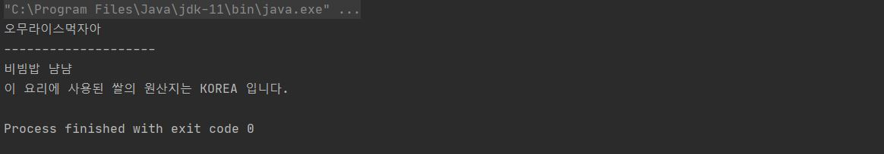
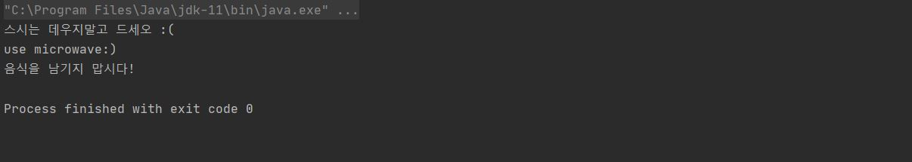

# JAVA ONLINE STUDY _ STUDYHALLE #8  
__과제 : 인터페이스__  
__목표 : 자바의 인터페이스에 대해 학습하기.__

---

## 인터페이스 interface  

`인터페이스 interface` 는 오직 추상메서드와 상수만을 멤버로 가질 수 있는 추상클래스라고 할 수 있다. 추상클래스는 추상메서드 뿐 아니라 일반메서드 또한 멤버로 가질 수 있으나, 인터페이스는 추상메서드와 상수 이외에는 어떠한 요소도 멤버로 허용하지 않는다.  
추상클래스를 상속하는 객체가 추상클래스에 정의된 추상메서드를 구현해야 하는 것 처럼, __인터페이스를 구현하는 객체는 해당 인터페이스에 정의된 추상메서드들을 반드시 구현해야 한다.__   

__인터페이스 사용시의 장점__  
1) 개발시간을 단축시킬 수 있다.  
    인터페이스가 작성되면, 메서드의 선언부가 작성되는 것이므로 메서드를 호출하는 쪽은 인터페이스를 구현하는 클래스가 작성될 때까지 기다리지 않고 동시에 개발을 진행할 수 있다.    
2) 표준화가 가능하다.  
    프로젝트에 사용되는 기본적인 틀을 인터페이스로 작성하고, 그 인터페이스를 구현하는 방식으로 프로그램을 작성함으로써 보다 일관적이고 정형화 된 개발이 가능하다.  
3) 서로 관계없는 클래스들에게 관계를 맺어줄 수 있다.    
    하나의 인터페이스를 공통적으로 구현하게 함으로써 관계를 맺을 수 있다.  
4) 독립적인 프로그래밍이 가능하다.  
    클래스와 클래스간의 직접적 관계를 인터페이스를 이용한 간접적 관계로 변경함으로써 한 클래스의 변경이 다른클래스에 영향을 미치지 않는 독립적인 프로그래밍이 가능하다.  
    
    
## 인터페이스 정의  
  
```
interface 인터페이스명 {
    public static final 타입 상수명 = 값;
    public abstract 메서드명(매개변수목록);
}
```

클래스 정의와 틀은 같으나 `class` 대신 `interface` 키워드를 사용한다. 접근제어자로 `public`이나 `default`를 사용할 수 있다.  
모든 멤버변수는 `public static final`, 메서드는 `public abstract` 이어야 하며 생략가능하다. 생략된 제어자는 컴파일 시 컴파일러가 자동으로 추가한다.

```java
interface Food {
    String foodName();
    void eat();
    void cook();
}
```

## 인터페이스 상속  
 
인터페이스는 인터페이스로부터만 상속받을 수 있으며, 클래스와는 달리 다중상속이 가능하다. 

```java
interface KoreanFood extends Food { void returnKimchi(); }
interface JapaneseFood extends Food { void returnMiso(); }
interface AsianFood extends KoreanFood, JapaneseFood { }
```

이 경우, 인터페이스는 메서드의 구현부를 작성할 수 없으므로 AsianFood에서 KoreanFood와 JapaneseFood의 메서드를 구현하지는 못하지만,
AsianFood를 구현하는 클래스가 있다면 Food, KoreanFood, JapaneseFood의 모든 메서드를 오버라이딩해야 한다.  

```java
class Omurice implements asianFood {

    @Override
    public String foodName() {
        return "오무라이스";
    }

    @Override
    public void eat() {
        System.out.println("오무라이스냠");
    }

    @Override
    public void cook() {
        System.out.println("cook 오무라이스");
    }

    @Override
    public void returnKimchi() {
        System.out.println("오무김치");
    }

    @Override
    public void returnMiso() {
        System.out.println("오무미소");
    }
}
```

## 인터페이스 구현  

인터페이스 역시 추상클래스처럼 그 자체로는 인스턴스를 생성할 수 없으며, 추상클래스가 상속을 통해 추상메서드를 완성하는 것 처럼,
인터페이스도 정의된 추상메서드의 몸통을 만들어주는 클래스를 작성해야 하며, `implements` 키워드를 사용해 구현할 수 있다.   

```java
class 클래스명 implements 인터페이스명 {
    // 인터페이스에 정의된 추상메서드 구현
}
``` 

한 클래스로 구현과 상속이 동시에 이루어질 수도 있다.

```java
class Rice {
    String origin;
    void riceOrigin() {
        System.out.println("이 요리에 사용된 쌀의 원산지는 "+origin+" 입니다.");
    }
}

class Bibimbap extends Rice implements Food {

    @Override
    public String foodName() {
        return "비빔밥";
    }

    @Override
    public void eat() {
        System.out.println("비빔밥냠");
    }

    @Override
    public void cook() {
        System.out.println("cook 비빔밥");
    }

}
```

만일 구현해야 하는 인터페이스의 메서드 중 일부만 구현한다면, 클래스에 `abstract`를 붙여 추상클래스로 선언해야 한다.

```java
abstract class Pasta implements Food{
    @Override
    public String foodName() {
        return "파스타";
    }
}
```


## 인터페이스 레퍼런스를 통해 구현체를 사용하는 방법  

인터페이스는 자신을 구현한 클래스의 조상이라고 할 수 있으므로, 다형성에 의해 해당 인터페이스 타입의 참조변수로 클래스의 인스턴스를 참조할 수 있으며, 형변환도 가능하다.  
그렇기 때문에 인터페이스는 메서드의 매개변수의 타입으로도 사용될 수 있다.  
이 때, (인터페이스타입의) 매개변수는 해당 인터페이스를 구현한 클래스의 인스턴스로 넘겨주어야 한다.  
  

```java  
package com.studyhalle;

public class InterfaceFoodEx {

    public static void main(String[] args) {

        Food omr = new Omurice();
        System.out.println(new InterfaceFoodEx().checkFoodType(omr)+"먹자아");

        Bibimbap bbb = new Bibimbap();
        bbb.eat();
        bbb.origin = "KOREA";  // Bibimbap 클래스는 Rice 클래스를 상속받고 있으므로
        bbb.riceOrigin();      // Rice 클래스의 멤버도 사용가능하다.

    }

    String checkFoodType(Food food) {

        if (food instanceof Omurice) return "오무라이스";
        else if(food instanceof Bibimbap) return "비빔밥";
        else if(food instanceof Sushi) return "스시";
        else if(food instanceof Pasta) return "파스타";

        return "낫음식";
    }

}
```
실행결과  
  


## 인터페이스의 기본 메소드 (Default Method), 자바 8  

원래 인터페이스에는 추상메서드만 선언가능했으나, JDK1.8부터 디폴트메서드와 static 메서드를 추가할 수 있게 되었다.  

`default method`는 추상메서드의 기본적인 구현을 제공하는 메서드이다.  
설계의 변경 등으로 이미 작성, 사용 된 인터페이스에 변경(새로운 메서드 추가)이 발생할 경우, 이 인터페이스를 구현한 기존의 모든 클래스들이 새로 추가된 메서드를 구현해야 하는 사태가 발생하는 것을 막기 위해 고안된 방법이다.  
키워드 `default`를 붙여 작성하며, 추상메서드와 달리 일반 메서드처럼 구현부{} 가 필요하다.  

접근제어자는 `public`이며 생략가능하다.  
또한, 다른 추상메서드와 마찬가지로 구현된 클래스에서 오버라이딩 할 수 있다.  


```java
interface Food {
    String foodName();
    void eat();
    void cook();

    default void heat() {
        System.out.println("use a microwave:)");
    };
}

class Sushi implements JapaneseFood {

    ...

    @Override
    public void heat() { System.out.println("스시는 데우지말고 드세오 :("); }
}
```

## 인터페이스의 static 메소드, 자바 8  

`static method` 는 인스턴스와 관계가 없는 독립적인 메서드로 인터페이스에 추가하지 못할 이유가 없었으나,  
인터페이스의 모든 메서드는 추상메서드이어야 한다는 규칙을 위해 인터페이스에서 작성하지 못하도록 하였다.  

그래서 자바 8 이전에는, 인터페이스와 관련된 static 메서드를 별도의 클래스에 따로 두어야 했다.  
`java.util.Collection` 인터페이스가 대표적인 경우로, 이 인터페이스와 관련된 static 메서드들이  
별도의 클래스인 `Collections` 클래스에 작성되어 있다.  

인터페이스의 static 메서드 역시 접근제어자는 `public` 이며 생략가능하지만, 구현클래스에서의 오버라이딩은 불가능하다.  

```java
interface Food {
    void foodName();
    void eat();
    void cook();

    default void heat() {
        System.out.println("use a microwave:)");
    };
    
     static void alert() {
        System.out.println("음식을 남기지 맙시다!");
    }
}
```

```Java  
    public static void main(String[] args) {

        Food ss = new Sushi();
        ss.heat();      // default method 오버라이딩
        
        Bibimbap bbb = new Bibimbap();
        bbb.heat();     // default method 오버라이딩 X
        
        Food.alert();   // Food 인스턴스타입으로 호출한 static method

    }
```
실행결과  
 

## 인터페이스의 private 메소드, 자바 9  

인터페이스의 내부메서드 (default, static method) 에서 사용하기 위한 메서드로, 구현클래스에서는 재정의하거나 사용할 수 없다.  

```Java
interface Food {
    String foodName();
    void eat();
    void cook();

    default void heat() {
        System.out.println("use "+returnMachine()+":)");
    }

    static void alert() {
        System.out.println("음식을 남기지 맙시다!");
    }

    private String returnMachine() {
        String[] machines = {"microwave", "oven", "gas stove", "induction range"};
        Random rd = new Random();
        return machines[rd.nextInt(4)];
    }
}
```
<br>
 
 
 ---  
 #### REFERENCE  
 남궁성, 「자바의 정석」, 도우출판, 2016  


